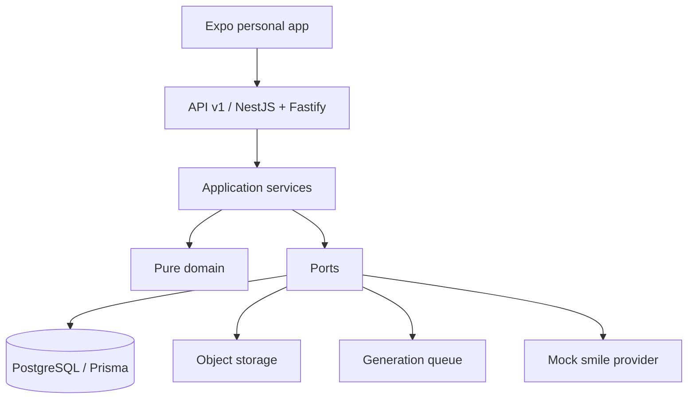

# DentPilot Smile Studio — النظرة المعمارية

> **DentPilot Smile Studio تطبيق شخصي لإنشاء المحتوى البصري للأسنان. ليس منصة إدارة عيادات أو نظام ممارسة متعدد الموظفين.**

## حدود المنتج

ينفذ Phase 1 مسارًا عموديًا شخصيًا: ينشئ المستخدم حالة خيالية، يرفع صورة مصدر، ينشئ مشروع محاكاة ابتسامة وهمي، يرسل وظيفة توليد إديمبوتنسية، ثم يعرض نتيجة غير سريرية. لا تنفذ هذه المرحلة مصادقة إنتاجية أو AI حقيقيًا أو فيديو أو مشاركة أو تصدير أو branding للحساب.

| المجال | المنفذ | المؤجل عمدًا |
|---|---|---|
| الهوية | ممثل تطوير مركزي لحساب مستخدم واحد | الجلسات والمصادقة الإنتاجية في Phase 2 |
| الملكية | `ownerUserId` في كل كيان تشغيلي | فرق وعضويات وأدوار؛ لا توجد في نموذج المنتج الحالي |
| الوسائط | فحص MIME والأبعاد وSHA-256 وتخزين كائنات | التخزين السحابي والإدارة المتقدمة للصور |
| التوليد | طابور غير متزامن ومزود وهمي حتمي | مزود Smile AI فعلي وفيديو |
| العميل | Expo Router ومسار My Cases ومشروعات ونتائج | تصميم المنتج النهائي |

## الاتجاه المعماري



يبقى المجال مستقلًا عن Prisma وNestJS وReact. تستدعي المتحكمات خدمات تطبيق رفيعة، وتنفذ البنية التحتية المنافذ، ويكون PostgreSQL سجل الحقيقة.

## الملكية والعزل

ينتمي كل من `PatientCase` و`MediaAsset` و`CreationProject` و`GenerationJob` و`GenerationVersion` و`AuditEvent` إلى `User` واحد بواسطة `ownerUserId`. يقيد كل منفذ قراءة وتعديل بهذا المالك، وتفرض PostgreSQL علاقات الطفل والأب التالية:

```text
(ownerUserId, parentId) → (ownerUserId, id)
```

لذلك لا يستطيع مستخدم A قراءة بيانات مستخدم B أو ربط Media بحالته أو مشروع بوسيطه أو Job/Version/lineage بكياناته. لا توجد `Clinic` أو `ClinicMembership` أو roles تشغيلية في المنتج النشط.

## الوسائط والتوليد

مسار التخزين خادمي فقط تحت `users/{ownerUserId}/cases/{caseId}/{kind}/{mediaId}`. لا يعاد مفتاح التخزين للعميل. تبقى وسائط SOURCE غير قابلة للتعديل، ويتحقق العامل من SHA-256 قبل المزود. تنشئ عملية النجاح الأصل المولد والإصدار والتدقيق وإنهاء الوظيفة ذريًا، وتحذف كائن النتيجة عند فشل الاستمرارية.

رسالة الطابور هي `{ schemaVersion, jobId, ownerUserId, correlationId }`. ينشئ العامل ممثل `system` مرتبطًا صراحة بالمالك في الرسالة ويتحقق من تطابق مالك الوظيفة؛ لا يفترض سياق مستخدم عام.

الإديمبوتنسية مقيدة بـ`(ownerUserId, projectId, idempotencyKey)` مع بصمة طلب ثابتة. يعيد المفتاح والبصمة نفسيهما الوظيفة نفسها، ويعيد المفتاح نفسه مع بصمة مختلفة `IDEMPOTENCY_CONFLICT`.

## حالة Phase 1

يحافظ التصحيح على ضمانات Phase 1.1 وPhase 1.2: القيود المركبة، lineage الوسائط، إثبات النتائج، تصنيف الفشل الدقيق، والتنظيف التعويضي. يبقى محول الطابور في الذاكرة تطويريًا وغير دائم، وهو خطر تشغيلي معروف خارج نطاق هذا التصحيح. قد تظهر بيانات طبيب أو ممارسة أو شعار أو تخصص مستقبلًا ضمن branding اختياري لملف المستخدم؛ لا تجعل ذلك نموذج عيادة أو فريق.


## بوابة سلامة الرسم النهائي

بعد Foundation final correction، لا يقتصر العزل على `ownerUserId`. تفرض PostgreSQL أيضًا حدود الحالة داخل المستخدم نفسه: لا يشير `DERIVED` أو `GENERATED` MediaAsset إلى مصدر من حالة أخرى، ولا يجمع `AuditEvent` حالة ومشروعًا ووظيفة من سلاسل منطقية مختلفة. تستخدم الضمانات مفاتيح أجنبية مركبة وقيود CHECK؛ لذلك لا تتوقف على سلامة طبقة التطبيق وحدها.

يوثق [ADR-017](../adr/ADR-017-postgresql-personal-graph-integrity.md) القرار النشط. ADR-005 وADR-011 وADR-013 محفوظة للتاريخ فقط وموسومة **SUPERSEDED**. لا توجد أي دلالة معمارية نشطة لعيادة أو workspace أو منظمة أو فريق.


## ملحق Phase 2A.1 — نواة الهوية والمصادقة

طبقة الهوية تضيف `users` و`password_credentials` و`auth_sessions` و`account_action_tokens` و`security_events` إلى PostgreSQL. جميع الموارد السريرية/الإبداعية تبقى مملوكة عبر `ownerUserId` للمستخدم الشخصي. يستعمل الممثل البشري `userId` و`sessionId?` و`requestId`، بينما يستعمل العامل النظامي `systemActorKey` مع `ownerUserId` للرسم المعالج. يحفظ سجل التدقيق شكل الممثل صراحة ولا يسمح بانتحال العامل النظامي للمستخدم.

توجد بدائيات البريد وكلمة المرور والـArgon2id ورموز الجلسة والرموز الحسابية فقط. لا يحتوي هذا الإصدار على تسجيل أو دخول أو endpoint مصادقة أو cookie أو JWT أو OAuth أو واجهة جوال للمصادقة؛ هذه جميعًا مؤجلة إلى Phase 2A.2.


## ملحق Phase 2A.2 — مصادقة HTTP والتفويض

استبدل API ممثل HTTP التطويري بجلسات Bearer opaque حقيقية. تعمل حراسة Nest عامة بنهج default-deny، ولا تستثني إلا health وعمليات auth العامة المحددة. بعد التحقق من SHA-256 للرمز وفحص صلاحية الجلسة وحالة المستخدم، تضع الحراسة `HumanActorContext` الذي تستعمله جميع متحكمات Foundation لاستخلاص `ownerUserId`. القيم التي يرسلها العميل مثل `ownerUserId` أو `userId` أو `X-Owner-User-Id` ليست مصدر تفويض.

يسلم التسجيل والتحقق والاستعادة روابط رموز opaque من خلال outbox تطويري خاص أو SMTP في الإنتاج؛ لا يخزن PostgreSQL النص الصريح. تحفظ الجلسات وaction tokens هاش SHA-256 فقط، وتبطل إعادة الضبط أو تغيير كلمة المرور كل الجلسات النشطة. تحمي قراءة الوسائط بنفس مسار Bearer/owner، ثم تضيف `Cache-Control: private, no-store` و`X-Content-Type-Options: nosniff`.

تعتمد حدود معدل المصادقة `auth_rate_limit_buckets` في PostgreSQL. تستخدم مفاتيح HMAC-SHA-256 مشتقة من البريد أو IP المنطقي، وupsert ذريًا لمنع تجاوز الحد بسباق الطلبات أو بإعادة تشغيل API. يسجل التطبيق `RateLimitExceeded` في أول تجاوز لكل bucket ونافذة فقط، دون حفظ بريد أو IP خام.

لا تزال Expo Mobile Authentication وSecureStore وواجهات تسجيل الدخول خارج النطاق؛ يقتصر Phase 2A.2 على API والخدمات والتوثيق والاختبارات.

## ملحق Phase 2B — عميل الهوية المحمول

يضيف تطبيق Expo طبقة `AuthProvider` فوق `QueryClientProvider`. لا يحتفظ التطبيق إلا بنص جلسة Bearer opaque في `expo-secure-store`، بينما يبقى الرمز المتاح للنقل في مرجع ذاكرة خاص بالمزوّد. يقرأ bootstrap الرمز ثم يستدعي `GET /account/me`: يزيل 401 أو إلغاء مؤكد التخزين والكاش، لكنه يحتفظ بالرمز ويعرض retryable عند تعذر الشبكة المؤقت حتى لا يساوي انقطاع الخدمة بانتهاء الجلسة.

تضيف `api-transport` تفويض Bearer للطلبات المحمية فقط، ومنه أيضًا مصدر الصورة المحمي للوسائط الناتجة. أي 401 محمي يمر بمسار invalidation واحد single-flight ينفذ `queryClient.clear()` ويمسح SecureStore وحالة الهوية؛ لذلك لا تظل بيانات المستخدم A في React Query عند دخول المستخدم B. لا تسمح شاشات Case/Media/Project/Generation بالاستعلام قبل وصول حالة `authenticated`.

تستخدم Routes عامة للتسجيل وتسجيل الدخول والتحقق وإعادة الإرسال والاستعادة وإعادة الضبط، بينما تتطلب شاشات الحالات والنتيجة والحساب جلسة مؤكدة. يستقبل المخطط `dentpilot://auth/action` رابط التحقق أو إعادة الضبط، ويحتفظ بالرمز في حالة ذاكرة قصيرة فقط قبل الاستهلاك؛ لا يوجد رمز إجراء في route params أو التخزين الدائم أو سجل العميل. يضيف الحساب تحديث الاسم، عرض الجلسات وإبطال الأخرى، تغيير كلمة المرور، logout وlogout-all، وكلها تتكيف مع إبطال الجلسات الخادمي في Phase 2A.2.

لا تضيف Phase 2B تغييرًا إلى Argon2id أو جلسات PostgreSQL opaque أو اشتقاق `ownerUserId` أو rate limiting أو SecurityEvents أو سلامة توليد Foundation. ولا تنفذ مزودات دخول اجتماعي أو 2FA أو passkeys أو biometrics أو اشتراكات أو فرق أو حذف حساب.

## ملحق الإغلاق الأمني لمرحلة 2

تحتفظ `password_credentials` بـ`credentialRevision` موجب. تقرأ login وchange password hash/revision snapshot، وتنفذ Argon2 خارج المعاملة، ثم تطابق snapshot في `UPDATE` ذري قبل إنشاء session أو استبدال hash. لذلك لا يعد التحقق الناجح لكلمة مرور قديمة تفويضًا دائمًا؛ إذا سبق reset أو change كتابة أحدث، تفشل العملية المتأخرة ولا تنشئ session ولا تستبدل الاعتماد. يقفل reset صف User ثم يستهلك action token ويكتب hash/revision ويلغي sessions وtokens الأخرى داخل معاملة واحدة.

يفرض PostgreSQL كذلك أن كل `AuditEvent` شخصي بشري يحقق `actorUserId = ownerUserId`. يبقى النظام ممثلًا غير بشري بـ`actorUserId = NULL` و`systemActorKey` غير فارغ، ويحافظ القيد على قيود owner/case/project/job وشكل الممثل السابقة. لا تعتمد هذه الحماية على serializer أو تحقق API وحده.

عند تعطيل User، يرفض `authenticateBearer` الجلسة الموجودة قبل إنتاج HumanActorContext. يصدر API `401` مع `ACCOUNT_DISABLED`، فيمر الرد المحمي إلى invalidator المحمول نفسه الخاص بالجلسات المنتهية أو الملغاة. يمسح المسار SecureStore وReact Query وحالة الهوية مرة واحدة حتى عند وصول عدة ردود 401؛ وبعد ذلك لا تعمل شاشات Foundation المحمية أو تحتفظ بكاش المستخدم.
