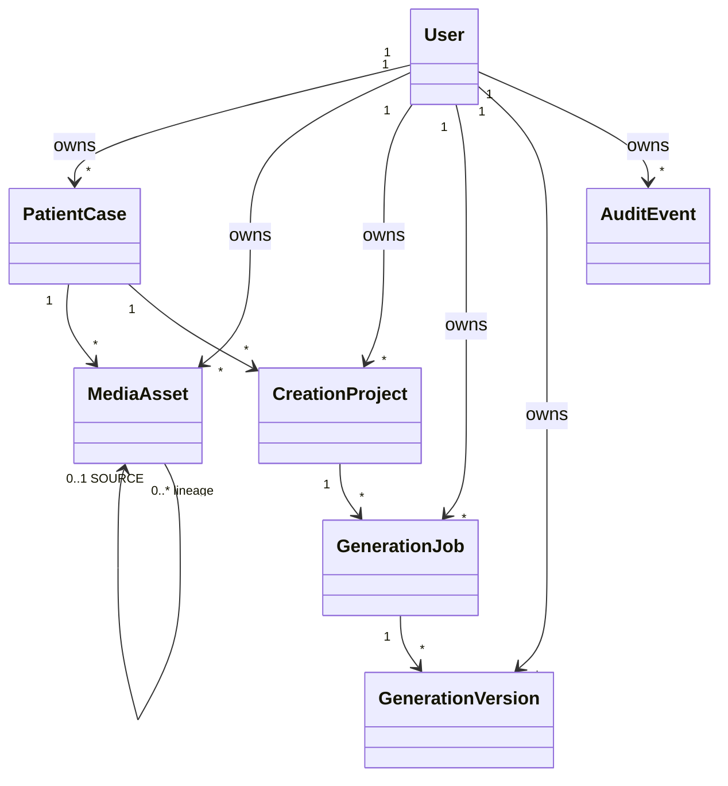

# نموذج مجال DentPilot Smile Studio

**الحالة:** تصحيح نموذج المنتج قبل Phase 2؛ تتوفر أساسات Phase 1 وPhase 1.1 وPhase 1.2 الآن تحت ملكية مستخدم شخصية.

> **DentPilot Smile Studio تطبيق شخصي تجاري لإنشاء محتوى الأسنان البصري. ليس نظام إدارة عيادات ولا نظام ممارسة متعدد الموظفين.**

## نموذج الملكية

كل كيان تشغيلي يحمل `ownerUserId`. لا يسمح النظام بقراءة كيان أو الإشارة إليه أو تعديله إلا مع `ownerUserId` المطابق. تفرض PostgreSQL المراجع المركبة `(ownerUserId, parentId) → (ownerUserId, id)` حيث توجد علاقات بين كيانات يملكها المستخدم.

| المفهوم | المالك | المسؤولية |
|---|---|---|
| `User` | المنصة | حساب الشخص الذي ينشئ ويحتفظ بمحتواه البصري. مصادقة الإنتاج مؤجلة إلى Phase 2. |
| `PatientCase` | `User` | حاوية عمل بصري، وليست سجلًا طبيًا أو خطة علاج. |
| `MediaAsset` | `User` و`PatientCase` | وصف وسيط مصدر أو مشتق أو مولد مخزن خارج PostgreSQL. |
| `CreationProject` | `User` و`PatientCase` | نية إنشاء مستقلة؛ يدعم Phase 1 محاكاة الابتسامة الوهمية. |
| `GenerationJob` | `User` و`CreationProject` | طلب غير متزامن وحالة مصدرها الخادم. |
| `GenerationVersion` | `User` و`GenerationJob` | لقطة إثبات ثابتة للناتج المولد. |
| `AuditEvent` | `User` | أثر إضافي غير قابل لإعادة الكتابة الصامتة. |

## الوسائط والإثبات

تبقى وسائط `source` أصلية وغير قابلة للتعديل. يحفظ `MediaAsset` نوع MIME المثبت خادميًا والحجم والأبعاد وSHA-256 ومفتاح تخزين مولد خادميًا ومرجع المصدر عند وجوده. لا تخزن البايتات داخل قاعدة البيانات، ولا ينشأ مفتاح التخزين من اسم ملف العميل.

قبل استدعاء مزود التوليد، تعيد الخدمة قراءة المصدر وتتحقق من SHA-256. تحفظ النتائج المولدة منفصلة، ويحتوي `GenerationVersion` على المصدر وتجزئته والمزود وإصداره وإصدار عقد التوليد والمعلمات. لا يوجد منفذ لتعديل نسخة مولدة.

## الوظائف والإديمبوتنسية

تملك `GenerationJob` دورة حياة `queued → processing → succeeded|failed` يحكمها الخادم. نطاق الإديمبوتنسية هو العملية المنطقية الشخصية: القيد الفريد هو `(ownerUserId, projectId, idempotencyKey)`. تعيد الإعادة بالمفتاح والبصمة نفسيهما الوظيفة نفسها؛ أما المفتاح نفسه مع بصمة مختلفة فيرجع `IDEMPOTENCY_CONFLICT`.

تحتوي رسالة الطابور ذات الإصدار على `jobId` و`ownerUserId` و`correlationId`. ينشئ العامل ممثل نظام مرتبطًا صراحة بالمالك الموجود في الرسالة ويتحقق من أن الوظيفة تنتمي إليه؛ لا يفترض العامل هوية مستخدم عالمية.

## ثوابت الأمان

| الثابت | آلية الفرض |
|---|---|
| عزل المستخدم | استعلامات المستودع تتطلب `ownerUserId`؛ مفاتيح PostgreSQL المركبة ترفض الإشارات المتقاطعة. |
| lineage الوسائط | لا يمكن لوسيط مستخدم A أن يستخدم مصدر مستخدم B. |
| سلامة المصدر | التحقق من SHA-256 قبل المزود، والفشل الآمن عند العبث. |
| سلامة النتيجة | إذا فشلت الاستمرارية بعد كتابة كائن مولد، يحذف الكائن ولا تسجل حالة نجاح زائفة. |
| عدم قابلية تعديل النسخ | إنشاء فقط، مع لقطة إثبات كاملة وقيد رقم الإصدار. |
| كشف الفشل الدقيق | تميز الخدمة القراءة والكتابة والمزود والناتج والاستمرارية بدل نسبة كل خطأ إلى المزود. |

اختيارًا مستقبلًا، قد يتضمن ملف مستخدم الطبيب اسمه أو اسم ممارسته أو شعارًا أو تخصصًا؛ هذه بيانات branding فقط ولا تنشئ عيادة أو عضوية أو دورًا تشغيليًا أو مساحة فريق.

## ملحق Phase 2A.1 — هوية المستخدم والممثلون

| المفهوم | العلاقة | القيد الأساسي |
|---|---|---|
| `User` | أصل الملكية الشخصية | بريد مطبع فريد وحالة `pending_verification` أو `active` أو `disabled`. |
| `PasswordCredential` | واحد إلى واحد مع `User` | Argon2id encoded hash فقط؛ لا كلمة مرور صريحة. |
| `AuthSession` | متعدد لكل `User` | SHA-256 token hash فريد، صلاحية مطلقة، وإلغاء قابل للتدقيق. |
| `AccountActionToken` | متعدد لكل `User` | غرض متحقق (`verify_email` أو `reset_password`) وhash فريد وحالة نهائية غير متضاربة. |
| `SecurityEvent` | اختياري لكل `User` | أثر أمني منفصل بوقت وطلب وmetadata آمنة. |
| `AuditEvent` | يملكه `User` | ممثل `human` يملك `actorUserId` أو ممثل `system` يملك `systemActorKey`، وليس كليهما. |

يمثل الإنسان الحساب الذي بدأ الطلب، بينما يمثل العامل النظامي عملية تقنية معروفة ويحتفظ بـ`ownerUserId` فقط لتحديد الرسم الشخصي الذي يعالجه. لا تتضمن Phase 2A.1 أي تدفق تسجيل أو دخول أو استعادة كلمة مرور؛ توفر فقط النماذج والقيود والبدائيات التي ستستهلكها Phase 2A.2.
